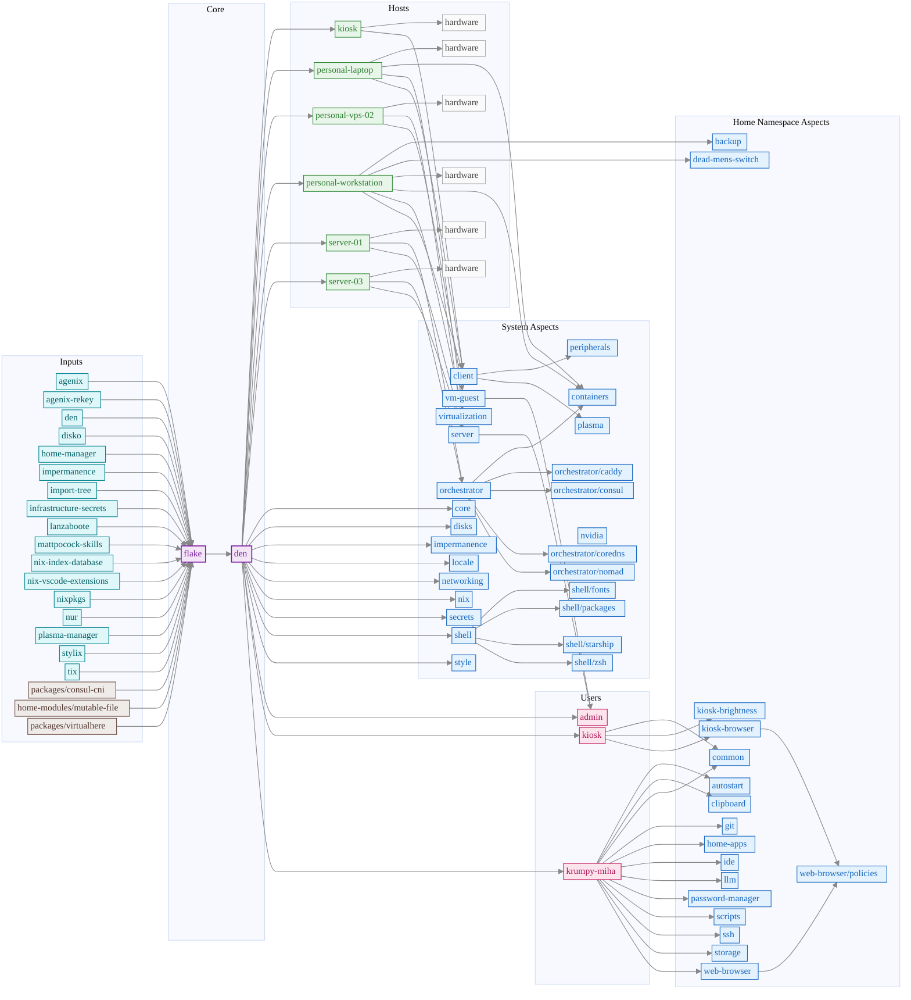

# Infrastructure

NixOS configuration repository for managing multiple hosts using flakes.

## Repository Structure

```sh
├── hosts/                  # Per-host configurations
├── nixosModules/           # NixOS modules (common/optional)
├── homeManagerModules/     # Home Manager modules and user configs
├── packages/               # Custom packages (flakes)
├── home-modules/           # Custom home-manager modules (flakes)
└── docs/                   # Documentation
```

## Hardware-config

Generate using (on remote):

```sh
nixos-generate-config --show-hardware-config
```

## TPM2 encryption key

Generate per machine TPM2 age key:

```sh
nix-shell -p age-plugin-tpm --command "sudo age-plugin-tpm -g"
```

## Stress test

Stress test:

```sh
nix-shell -p btop --command "btop"
nix-shell -p stress s-tui --command "s-tui"
```

## Build Statistics

<!-- STATS_START -->

## NixOS Configuration Sizes

Generated: 2026-05-19 18:48
**Statistics computed over 2 build run(s)**

**Table 1:** NixOS system configuration sizes and evaluation times for each host.

This table presents the closure size (total disk space required for all dependencies)
and evaluation time (time to compute the Nix derivation) for each configured host
in the infrastructure. Closure size is measured in GiB (gibibytes, 2³⁰ bytes)
and represents the complete set of packages, libraries, and system components
required for each configuration. System/Home Pkgs shows the count of packages
in each profile (excluding -doc, -man, -info, -dev, -bin outputs).
System/Home Refs shows the total recursive dependencies for each profile.
Evaluation time measures the computational overhead of the Nix
expression evaluator and is performed on cached derivations, representing the
minimal overhead when no packages need rebuilding.

|                 Host |   Closure Size |   System Pkgs |   Home Pkgs |   System Refs |   Home Refs |       Eval Time |
|---------------------:|---------------:|--------------:|------------:|--------------:|------------:|----------------:|
|                kiosk |       9.78 GiB |          1422 |         461 |          2135 |         510 |  12.60s ± 0.05s |
|      personal-laptop |      35.96 GiB |          6251 |        5541 |          8293 |        6886 |  19.41s ± 0.60s |
|      personal-vps-02 |       3.25 GiB |           663 |           - |          1168 |           - |   5.58s ± 4.09s |
| personal-workstation |      36.92 GiB |          6301 |        5541 |          8366 |        6887 | 12.14s ± 12.01s |
|            server-01 |       5.02 GiB |           697 |           - |          1236 |           - |   6.67s ± 5.55s |
|            server-03 |       5.03 GiB |           697 |           - |          1231 |           - |   6.58s ± 5.55s |

## Timing Statistics

**Table 3:** Detailed timing statistics across multiple runs.

|                 Host |    Mean |   Median |   Std Dev |     Min |     Max |   Runs |
|---------------------:|--------:|---------:|----------:|--------:|--------:|-------:|
|                kiosk | 12.603s |  12.603s |    0.050s | 12.568s | 12.639s |      2 |
|      personal-laptop | 19.405s |  19.405s |    0.596s | 18.984s | 19.826s |      2 |
|      personal-vps-02 |  5.575s |   5.575s |    4.089s |  2.684s |  8.466s |      2 |
| personal-workstation | 12.140s |  12.140s |   12.007s |  3.650s | 20.631s |      2 |
|            server-01 |  6.673s |   6.673s |    5.551s |  2.748s | 10.598s |      2 |
|            server-03 |  6.583s |   6.583s |    5.548s |  2.660s | 10.506s |      2 |

### Visualizations

- 
- 

## Closure Reuse Matrix

**Table 2:** Binary-level dependency sharing between host configurations.

This matrix quantifies the degree of dependency reuse across different NixOS host
configurations. Each cell shows the percentage of packages (derivations) from the
row host's closure that also appear in the column host's closure. A value of 100%
would indicate complete subsumption (all packages from row host are present in column
host). The diagonal shows dashes (-) as self-comparison is omitted. Higher percentages
indicate greater infrastructure consolidation potential through shared package caches
and common dependency management. This metric is particularly relevant for optimizing
distributed builds, reducing network transfer overhead, and minimizing storage
requirements in multi-host deployments.

|                 Host |   kiosk |   personal-laptop |   personal-vps-02 |   personal-workstation |   server-01 |   server-03 |
|---------------------:|--------:|------------------:|------------------:|-----------------------:|------------:|------------:|
|                kiosk |       - |               94% |               47% |                    94% |         49% |         49% |
|      personal-laptop |     24% |                 - |               12% |                    99% |         12% |         13% |
|      personal-vps-02 |     86% |               86% |                 - |                    86% |         92% |         92% |
| personal-workstation |     24% |               98% |               12% |                      - |         12% |         12% |
|            server-01 |     85% |               86% |               87% |                    86% |           - |         95% |
|            server-03 |     85% |               87% |               87% |                    87% |         95% |           - |
<!-- STATS_END -->

## Dependency Graph

<!-- DEPS_START -->

<!-- DEPS_END -->

## TODO

- https://github.com/yorukot/superfile
- https://github.com/amadejkastelic/nixos-config/tree/main/hosts/server
- https://nixos-and-flakes.thiscute.world/nixos-with-flakes/modularize-the-configuration
- https://docs.nixbuild.net/remote-builds/

## References

Configs:

- https://github.com/raexera/yuki
- https://github.com/wiedzmin/nixos-config
- https://github.com/Zaechus/nixos-config
- https://github.com/erictossell/nixflakes
- https://github.com/etu/nixconfig
- https://codeberg.org/highghlow/nixos-config
- https://github.com/leoank/neusis: Nvidia Datacenter GPU
- https://github.com/pranjalv123/nix-config: VMs
- https://github.com/abehidek/nix-config: VMs
