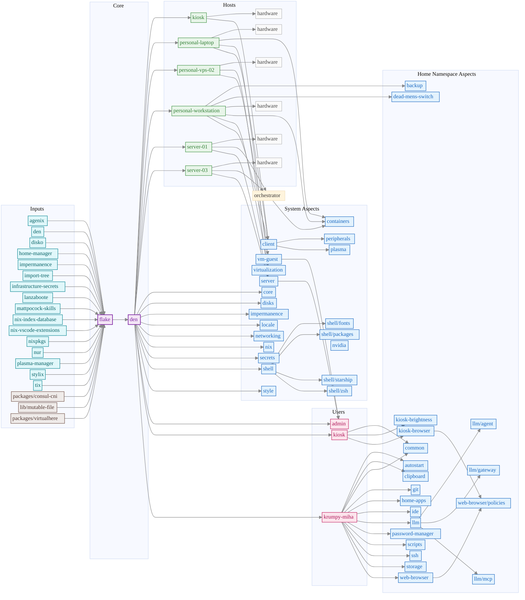

# Infrastructure

NixOS configuration repository for managing multiple hosts using flakes.

## Repository Structure

```sh
├── flake.nix               # Flake entry point
├── modules/
│   ├── den.nix             # Den framework: host declarations & aspect composition
│   ├── hosts/              # Per-host configurations & hardware configs
│   ├── users/              # User account definitions
│   ├── system/
│   │   ├── default/        # Baseline system aspects (core, disks, nix, networking, …)
│   │   ├── optional/       # Optional system aspects (plasma, containers, nvidia, …)
│   │   └── type/           # Host type aspects (client, server, vm-guest)
│   └── home/               # Home-manager aspects (git, ide, browser, scripts, …)
├── packages/               # Custom package flakes (consul-cni, virtualhere)
├── lib/                    # Standalone library/module flakes (mutable-file)
├── scripts/                # Utility scripts (generate_stats.py, flake_graph.py)
└── docs/                   # Documentation
```

## Hosts

| **Host** | **Type** | **Boot** | **Disk enc.** | **Local login** | **Secrets enc.** | **Impermanence** | **Home Manager** |
|---|---|---|---|---|---|---|---|
| personal-workstation | Client | Lanzaboote | FIDO2 | FIDO2 | TPM | Default | Full |
| personal-laptop | Client | Lanzaboote | FIDO2 | FIDO2 | TPM | Default | Full |
| server-01 | Server | Lanzaboote | TPM2 | Password | TPM | Default | None |
| server-03 | Server | systemd-boot | TPM2 | Password | TPM | Default | None |
| personal-vps-02 | Server+VM guest | GRUB | None | Password | SSH key | Default | None |
| kiosk | Client (kiosk) | Lanzaboote | TPM2 | Auto | TPM | Maximum | Kiosk-only |

## Build Statistics

<!-- STATS_START -->

commit hash: 47fde4a3c3973d0428debe4294be01e5e1de2564

nix (Nix) 2.34.7

Kernel: 7.1.2

CPU: AMD Ryzen 9 5900HX with Radeon Graphics

Disk: Micron Technology Inc 3400 NVMe SSD [Hendrix] (SN: MTFDKBA512TFH-1BC1AABHA)

Memory: 29 GiB


## Lines of Code

**Table 1:** Non-blank lines across the flake's source tree.

LOC excludes blank lines but includes comments. All file types are counted (`.nix`, `.json`, `.jsonc`, `.sh`, `.ini`, etc.) except Markdown (`.md`).

| Component        |   Lines |
|:-----------------|--------:|
| flake.nix        |      89 |
| modules/den.nix  |      94 |
| modules/hosts    |     462 |
| modules/system   |    1942 |
| modules/home     |    2831 |
| modules/users    |     184 |
| modules (total)  |    5513 |
| packages (total) |     279 |
| lib (total)      |      97 |
| **Total**        |    5978 |

## NixOS Configuration Sizes

**Table 2:** NixOS system configuration sizes for each host.

This table presents the closure size (total disk space required for all dependencies) for each configured host in the infrastructure. Closure size is measured in GiB (gibibytes, 2³⁰ bytes) and represents the complete set of packages, libraries, and system components required for each configuration. System/Home Pkgs shows the count of packages in each profile (excluding -doc, -man, -info, -dev, -bin outputs). System/Home Refs shows the total recursive dependencies for each profile.

|                 Host |   Closure Size |   System Pkgs |   Home Pkgs |   System Refs |   Home Refs |
|---------------------:|---------------:|--------------:|------------:|--------------:|------------:|
|                kiosk |      10.39 GiB |          1434 |         521 |          2179 |         576 |
|      personal-laptop |      36.60 GiB |          6241 |        5527 |          8299 |        6869 |
|      personal-vps-02 |       3.60 GiB |           675 |           - |          1182 |           - |
| personal-workstation |      37.62 GiB |          6293 |        5530 |          8379 |        6875 |
|            server-01 |       6.12 GiB |           705 |           - |          1244 |           - |
|            server-03 |       4.38 GiB |           683 |           - |          1197 |           - |

## Eval Performance

**Statistics computed over 5 run(s)**

### Sequential

**Table 3:** Evaluation time per host with no concurrent evaluation. Each host is evaluated in isolation using `nix eval --option eval-cache false` to ensure deterministic, cache-free measurements.

|                 Host |    Mean |   Median |   Std Dev |     Min |     Max |   Runs |
|---------------------:|--------:|---------:|----------:|--------:|--------:|-------:|
|                kiosk | 12.705s |  12.685s |    0.069s | 12.621s | 12.811s |      5 |
|      personal-laptop | 17.332s |  17.370s |    0.140s | 17.187s | 17.518s |      5 |
|      personal-vps-02 |  8.604s |   8.618s |    0.042s |  8.551s |  8.651s |      5 |
| personal-workstation | 17.573s |  17.518s |    0.166s | 17.423s | 17.776s |      5 |
|            server-01 |  9.713s |   9.707s |    0.110s |  9.545s |  9.837s |      5 |
|            server-03 |  8.603s |   8.626s |    0.098s |  8.482s |  8.717s |      5 |

### Simultaneous

**Table 4:** Evaluation time per host with all hosts evaluated concurrently. All hosts are evaluated in parallel to measure the overhead of concurrent Nix evaluation (CPU contention, lock contention, etc.).

|                 Host |    Mean |   Median |   Std Dev |     Min |     Max |   Runs |
|---------------------:|--------:|---------:|----------:|--------:|--------:|-------:|
|                kiosk | 25.402s |  25.402s |    0.062s | 25.316s | 25.468s |      5 |
|      personal-laptop | 30.461s |  30.467s |    0.169s | 30.259s | 30.661s |      5 |
|      personal-vps-02 | 20.726s |  20.738s |    0.099s | 20.607s | 20.861s |      5 |
| personal-workstation | 30.552s |  30.562s |    0.077s | 30.435s | 30.628s |      5 |
|            server-01 | 22.033s |  22.020s |    0.078s | 21.961s | 22.161s |      5 |
|            server-03 | 20.676s |  20.668s |    0.080s | 20.557s | 20.755s |      5 |

## Closure Reuse Matrix

**Table 5:** Binary-level dependency sharing between host configurations.

This matrix quantifies the degree of dependency reuse across different NixOS host configurations. Each cell shows the percentage of packages (derivations) from the row host's closure that also appear in the column host's closure. A value of 100% would indicate complete subsumption. The diagonal shows dashes (-) as self-comparison is omitted. Higher percentages indicate greater infrastructure consolidation potential through shared package caches and common dependency management.

|                 Host |   kiosk |   personal-laptop |   personal-vps-02 |   personal-workstation |   server-01 |   server-03 |
|---------------------:|--------:|------------------:|------------------:|-----------------------:|------------:|------------:|
|                kiosk |       - |               94% |               47% |                    93% |         49% |         48% |
|      personal-laptop |     24% |                 - |               12% |                    99% |         12% |         12% |
|      personal-vps-02 |     87% |               87% |                 - |                    87% |         93% |         94% |
| personal-workstation |     24% |               98% |               12% |                      - |         12% |         12% |
|            server-01 |     86% |               85% |               88% |                    85% |           - |         91% |
|            server-03 |     88% |               88% |               93% |                    88% |         95% |           - |<!-- STATS_END -->

## Dependency Graph

<!-- DEPS_START -->

<!-- DEPS_END -->

## TODO

- https://saylesss88.github.io/nix/hardening_NixOS.html
- https://github.com/yorukot/superfile
- https://github.com/amadejkastelic/nixos-config/tree/main/hosts/server
- https://docs.nixbuild.net/remote-builds/

## References

Sources:

- https://nixos-and-flakes.thiscute.world

Configs:

- https://github.com/mightyiam/infra: dendritic pattern
- https://github.com/vic/vix: dendritic pattern
- https://github.com/GaetanLepage/nix-config
- https://github.com/raexera/yuki
- https://github.com/wiedzmin/nixos-config
- https://github.com/Zaechus/nixos-config
- https://github.com/erictossell/nixflakes
- https://github.com/etu/nixconfig
- https://codeberg.org/highghlow/nixos-config
- https://github.com/leoank/neusis: Nvidia Datacenter GPU
- https://github.com/pranjalv123/nix-config: VMs
- https://github.com/abehidek/nix-config: VMs
