# Infrastructure

NixOS configuration repository for managing multiple hosts using flakes.

## Repository Structure

```sh
├── hosts/                  # Per-host configurations
├── nixosModules/           # NixOS modules (common/optional)
├── homeManagerModules/     # Home Manager modules and user configs
├── packages/               # Custom packages (flakes)
├── home-modules/           # Custom home-manager modules (flakes)
└── docs/                   # Documentation
```

## Hardware-config

Generate using (on remote):

```sh
nixos-generate-config --show-hardware-config
```

## TPM2 encryption key

Generate per machine TPM2 age key:

```sh
nix-shell -p age-plugin-tpm --command "sudo age-plugin-tpm -g"
```

## Stress test

Stress test:

```sh
nix-shell -p btop --command "btop"
nix-shell -p stress s-tui --command "s-tui"
```

## Build Statistics

<!-- STATS_START -->

## NixOS Configuration Sizes

Generated: 2026-03-27 17:57

**Table 1:** NixOS system configuration sizes and evaluation times for each host.

This table presents the closure size (total disk space required for all dependencies)
and evaluation time (time to compute the Nix derivation) for each configured host
in the infrastructure. Closure size is measured in GiB (gibibytes, 2³⁰ bytes)
and represents the complete set of packages, libraries, and system components
required for each configuration. Evaluation time measures the computational overhead
of the Nix expression evaluator and is performed on cached derivations, representing
the minimal overhead when no packages need rebuilding. The derivation column shows
the unique Nix store path identifying each configuration build.

| Host                 | Closure Size   | Eval Time   | Derivation                                                                                           |
|:---------------------|:---------------|:------------|:-----------------------------------------------------------------------------------------------------|
| kiosk                | 10.33 GiB      | 16.00s      | /nix/store/dyif7j0rjrrg3wvc6l52swyy2ahcffkc-nixos-system-kiosk-26.05.20260324.46db2e0                |
| personal-laptop      | 33.16 GiB      | 23.07s      | /nix/store/dcklj0mynqphhnviaqfwi3faffwjsh3m-nixos-system-personal-laptop-26.05.20260324.46db2e0      |
| personal-workstation | 34.11 GiB      | 22.62s      | /nix/store/cdvjqpdz0x294zxid10sbqmi4gbmq3lx-nixos-system-personal-workstation-26.05.20260324.46db2e0 |
| server-01            | 4.79 GiB       | 12.71s      | /nix/store/60bllh8al62yfr3x426jxqlh83x9flwk-nixos-system-server-01-26.05.20260324.46db2e0            |
| server-03            | 4.38 GiB       | 11.59s      | /nix/store/719yf3h9fcgvby3sc3h6rgy5rl3h4a8k-nixos-system-server-03-26.05.20260324.46db2e0            |
| vps-02               | 3.60 GiB       | 9.93s       | /nix/store/9g9hiv4mby2fi8ynjk38y9r436f4ybwr-nixos-system-vps-02-26.05.20260324.46db2e0               |

## Closure Reuse Matrix

**Table 2:** Binary-level dependency sharing between host configurations.

This matrix quantifies the degree of dependency reuse across different NixOS host
configurations. Each cell shows the percentage of packages (derivations) from the
row host's closure that also appear in the column host's closure. A value of 100%
would indicate complete subsumption (all packages from row host are present in column
host). The diagonal shows dashes (-) as self-comparison is omitted. Higher percentages
indicate greater infrastructure consolidation potential through shared package caches
and common dependency management. This metric is particularly relevant for optimizing
distributed builds, reducing network transfer overhead, and minimizing storage
requirements in multi-host deployments.

|                 Host |   kiosk |   personal-laptop |   personal-workstation |   server-01 |   server-03 |   vps-02 |
|---------------------:|--------:|------------------:|-----------------------:|------------:|------------:|---------:|
|                kiosk |       - |               94% |                    94% |         46% |         46% |      46% |
|      personal-laptop |     24% |                 - |                    98% |         12% |         12% |      12% |
| personal-workstation |     24% |               98% |                      - |         12% |         12% |      12% |
|            server-01 |     86% |               87% |                    87% |           - |         93% |      89% |
|            server-03 |     87% |               90% |                    89% |         94% |           - |      92% |
|               vps-02 |     87% |               88% |                    88% |         91% |         92% |        - |
<!-- STATS_END -->

## Dependency Graph

```mermaid
%%{init: {
  'theme': 'base',
  'themeVariables': {
    'fontSize': '14px',
    'fontFamily': 'system-ui',
    'lineColor': '#888'
  },
  'flowchart': {
    'nodeSpacing': 3,
    'rankSpacing': 40,
    'padding': 2,
    'diagramPadding': 3
  }
}}%%

flowchart TD

    %% Styles
    classDef input fill:#e3f2fd,stroke:#1565c0,stroke-width:1px,color:#1565c0
    classDef local fill:#fff8e1,stroke:#ef6c00,stroke-width:1px,color:#e65100
    classDef flake fill:#f3e5f5,stroke:#7b1fa2,stroke-width:1.5px,color:#7b1fa2
    classDef hosts fill:#e8f5e9,stroke:#388e3c,stroke-width:1px,color:#2e7d32
    classDef users fill:#fce4ec,stroke:#c2185b,stroke-width:1px,color:#ad1457
    classDef modules fill:#fff8e1,stroke:#f57c00,stroke-width:1px,color:#e65100
    classDef config fill:#fafafa,stroke:#757575,stroke-width:0.5px,color:#424242

    subgraph Inputs[Inputs]
        input_agenix["agenix"]:::input
        input_disko["disko"]:::input
        input_home_manager["home-manager"]:::input
        input_impermanence["impermanence"]:::input
        input_lanzaboote["lanzaboote"]:::input
        input_nix_index_database["nix-index-database"]:::input
        input_nix_vscode_extensions["nix-vscode-extensions"]:::input
        input_nixpkgs["nixpkgs"]:::input
        input_nur["nur"]:::input
        input_plasma_manager["plasma-manager"]:::input
        input_stylix["stylix"]:::input
        input_zen_browser["zen-browser"]:::input
        local_consul_cni["consul-cni"]:::local
        local_mutable_file["mutable-file"]:::local
        local_virtualhere["virtualhere"]:::local
    end

    subgraph Core[Core]
        flake["flake.nix"]:::flake
    end

    subgraph Hosts[Hosts]
        hosts_node["hosts"]:::hosts
        host_kiosk["kiosk"]:::hosts
        host_personal_laptop["personal-laptop"]:::hosts
        host_personal_workstation["personal-workstation"]:::hosts
        host_server_01["server-01"]:::hosts
        host_server_03["server-03"]:::hosts
        host_vps_02["vps-02"]:::hosts
    end

    subgraph Users[Users]
        users_node["users"]:::users
        user_kiosk["kiosk"]:::users
        user_krumpy_miha["krumpy-miha"]:::users
    end

    subgraph Modules[Modules]
        homeManagerModules__common__default_nix["common"]:::modules
        homeManagerModules__default_nix["homeManagerModules"]:::modules
        nixosModules__common__core__console_nix["console"]:::modules
        nixosModules__common__core__default_nix["core"]:::modules
        nixosModules__common__core__disks_nix["disks"]:::modules
        nixosModules__common__core__impermanence_nix["impermanence"]:::modules
        nixosModules__common__core__networking_nix["networking"]:::modules
        nixosModules__common__core__nix_nix["nix"]:::modules
        nixosModules__common__core__secrets_nix["secrets"]:::modules
        nixosModules__common__core__shell__default_nix["shell"]:::modules
        nixosModules__common__core__shell__starship_nix["starship"]:::modules
        nixosModules__common__core__shell__zsh_nix["zsh"]:::modules
        nixosModules__common__core__style_nix["style"]:::modules
        nixosModules__common__default_nix["common"]:::modules
        nixosModules__common__security__default_nix["security"]:::modules
        nixosModules__common__virt__default_nix["virt"]:::modules
        nixosModules__default_nix["nixosModules"]:::modules
        nixosModules__optional__de__default_nix["de"]:::modules
        nixosModules__optional__de__plasma__default_nix["plasma"]:::modules
        nixosModules__optional__default_nix["optional"]:::modules
        nixosModules__optional__miscellaneous__default_nix["miscellaneous"]:::modules
        nixosModules__optional__nvidia__default_nix["nvidia"]:::modules
        nixosModules__optional__orchestrator__default_nix["orchestrator"]:::modules
        nixosModules__optional__store_secrets__default_nix["store-secrets"]:::modules
    end

    subgraph HostConfigs[Host Configs]
        hosts__kiosk__brightness_nix["brightness"]:::config
        hosts__kiosk__configuration_nix["config"]:::config
        hosts__kiosk__hardware_configuration_nix["hw"]:::config
        hosts__personal_laptop__configuration_nix["config"]:::config
        hosts__personal_laptop__hardware_configuration_nix["hw"]:::config
        hosts__personal_workstation__configuration_nix["config"]:::config
        hosts__personal_workstation__hardware_configuration_nix["hw"]:::config
        hosts__server_01__configuration_nix["config"]:::config
        hosts__server_01__hardware_configuration_nix["hw"]:::config
        hosts__server_03__configuration_nix["config"]:::config
        hosts__server_03__hardware_configuration_nix["hw"]:::config
        hosts__vps_02__configuration_nix["config"]:::config
        hosts__vps_02__hardware_configuration_nix["hw"]:::config
    end

    subgraph UserConfigs[User Configs]
        homeManagerModules__users__kiosk__home__default_nix["home"]:::config
        homeManagerModules__users__kiosk__system__default_nix["system"]:::config
        homeManagerModules__users__krumpy_miha__home__autostart_nix["autostart"]:::config
        homeManagerModules__users__krumpy_miha__home__backup__default_nix["backup"]:::config
        homeManagerModules__users__krumpy_miha__home__clipboard__default_nix["clipboard"]:::config
        homeManagerModules__users__krumpy_miha__home__dead_mens_switch__default_nix["dead-mens-switch"]:::config
        homeManagerModules__users__krumpy_miha__home__default_nix["home"]:::config
        homeManagerModules__users__krumpy_miha__home__git__default_nix["git"]:::config
        homeManagerModules__users__krumpy_miha__home__home_nix["home"]:::config
        homeManagerModules__users__krumpy_miha__home__ide__default_nix["ide"]:::config
        homeManagerModules__users__krumpy_miha__home__password_manager__default_nix["password-manager"]:::config
        homeManagerModules__users__krumpy_miha__home__scripts__default_nix["scripts"]:::config
        homeManagerModules__users__krumpy_miha__home__ssh_nix["ssh"]:::config
        homeManagerModules__users__krumpy_miha__home__storage_nix["storage"]:::config
        homeManagerModules__users__krumpy_miha__home__web_browser__default_nix["web-browser"]:::config
        homeManagerModules__users__krumpy_miha__system__default_nix["system"]:::config
    end

    input_agenix --> flake
    input_disko --> flake
    input_home_manager --> flake
    input_impermanence --> flake
    input_lanzaboote --> flake
    input_nix_index_database --> flake
    input_nix_vscode_extensions --> flake
    input_nixpkgs --> flake
    input_nur --> flake
    input_plasma_manager --> flake
    input_stylix --> flake
    input_zen_browser --> flake
    local_consul_cni --> flake
    local_mutable_file --> flake
    local_virtualhere --> flake
    flake --> hosts_node
    flake --> users_node
    flake --> nixosModules__default_nix
    flake --> homeManagerModules__default_nix
    hosts_node --> host_kiosk
    hosts_node --> host_personal_laptop
    hosts_node --> host_personal_workstation
    hosts_node --> host_server_01
    hosts_node --> host_server_03
    hosts_node --> host_vps_02
    users_node --> user_kiosk
    users_node --> user_krumpy_miha
    host_kiosk --> hosts__kiosk__brightness_nix
    host_kiosk --> hosts__kiosk__configuration_nix
    host_kiosk --> hosts__kiosk__hardware_configuration_nix
    host_personal_laptop --> hosts__personal_laptop__configuration_nix
    host_personal_laptop --> hosts__personal_laptop__hardware_configuration_nix
    host_personal_workstation --> hosts__personal_workstation__configuration_nix
    host_personal_workstation --> hosts__personal_workstation__hardware_configuration_nix
    host_server_01 --> hosts__server_01__configuration_nix
    host_server_01 --> hosts__server_01__hardware_configuration_nix
    host_server_03 --> hosts__server_03__configuration_nix
    host_server_03 --> hosts__server_03__hardware_configuration_nix
    host_vps_02 --> hosts__vps_02__configuration_nix
    host_vps_02 --> hosts__vps_02__hardware_configuration_nix
    user_kiosk --> homeManagerModules__users__kiosk__system__default_nix
    user_kiosk --> homeManagerModules__users__kiosk__home__default_nix
    user_krumpy_miha --> homeManagerModules__users__krumpy_miha__system__default_nix
    user_krumpy_miha --> homeManagerModules__users__krumpy_miha__home__default_nix

    homeManagerModules__default_nix --> homeManagerModules__common__default_nix
    homeManagerModules__default_nix --> nixosModules__optional__store_secrets__default_nix
    nixosModules__common__core__default_nix --> nixosModules__common__core__console_nix
    nixosModules__common__core__default_nix --> nixosModules__common__core__disks_nix
    nixosModules__common__core__default_nix --> nixosModules__common__core__impermanence_nix
    nixosModules__common__core__default_nix --> nixosModules__common__core__networking_nix
    nixosModules__common__core__default_nix --> nixosModules__common__core__nix_nix
    nixosModules__common__core__default_nix --> nixosModules__common__core__secrets_nix
    nixosModules__common__core__default_nix --> nixosModules__common__core__shell__default_nix
    nixosModules__common__core__default_nix --> nixosModules__common__core__style_nix
    nixosModules__common__core__shell__default_nix --> nixosModules__common__core__shell__starship_nix
    nixosModules__common__core__shell__default_nix --> nixosModules__common__core__shell__zsh_nix
    nixosModules__common__default_nix --> nixosModules__common__core__default_nix
    nixosModules__common__default_nix --> nixosModules__common__security__default_nix
    nixosModules__common__default_nix --> nixosModules__common__virt__default_nix
    nixosModules__default_nix --> nixosModules__common__default_nix
    nixosModules__default_nix --> nixosModules__optional__default_nix
    nixosModules__optional__de__default_nix --> nixosModules__optional__de__plasma__default_nix
    nixosModules__optional__default_nix --> nixosModules__optional__de__default_nix
    nixosModules__optional__default_nix --> nixosModules__optional__miscellaneous__default_nix
    nixosModules__optional__default_nix --> nixosModules__optional__nvidia__default_nix
    nixosModules__optional__default_nix --> nixosModules__optional__orchestrator__default_nix
    nixosModules__optional__default_nix --> nixosModules__optional__store_secrets__default_nix
    homeManagerModules__users__krumpy_miha__home__default_nix --> homeManagerModules__users__krumpy_miha__home__autostart_nix
    homeManagerModules__users__krumpy_miha__home__default_nix --> homeManagerModules__users__krumpy_miha__home__backup__default_nix
    homeManagerModules__users__krumpy_miha__home__default_nix --> homeManagerModules__users__krumpy_miha__home__clipboard__default_nix
    homeManagerModules__users__krumpy_miha__home__default_nix --> homeManagerModules__users__krumpy_miha__home__dead_mens_switch__default_nix
    homeManagerModules__users__krumpy_miha__home__default_nix --> homeManagerModules__users__krumpy_miha__home__git__default_nix
    homeManagerModules__users__krumpy_miha__home__default_nix --> homeManagerModules__users__krumpy_miha__home__home_nix
    homeManagerModules__users__krumpy_miha__home__default_nix --> homeManagerModules__users__krumpy_miha__home__ide__default_nix
    homeManagerModules__users__krumpy_miha__home__default_nix --> homeManagerModules__users__krumpy_miha__home__password_manager__default_nix
    homeManagerModules__users__krumpy_miha__home__default_nix --> homeManagerModules__users__krumpy_miha__home__scripts__default_nix
    homeManagerModules__users__krumpy_miha__home__default_nix --> homeManagerModules__users__krumpy_miha__home__ssh_nix
    homeManagerModules__users__krumpy_miha__home__default_nix --> homeManagerModules__users__krumpy_miha__home__storage_nix
    homeManagerModules__users__krumpy_miha__home__default_nix --> homeManagerModules__users__krumpy_miha__home__web_browser__default_nix

```

<!-- DEPS_START -->

<!-- DEPS_END -->

## TODO

- https://github.com/yorukot/superfile
- https://github.com/amadejkastelic/nixos-config/tree/main/hosts/server
- https://nixos-and-flakes.thiscute.world/nixos-with-flakes/modularize-the-configuration
- https://docs.nixbuild.net/remote-builds/

## References

Configs:

- https://github.com/raexera/yuki
- https://github.com/wiedzmin/nixos-config
- https://github.com/Zaechus/nixos-config
- https://github.com/erictossell/nixflakes
- https://github.com/etu/nixconfig
- https://codeberg.org/highghlow/nixos-config
- https://github.com/leoank/neusis: Nvidia Datacenter GPU
- https://github.com/pranjalv123/nix-config: VMs
- https://github.com/abehidek/nix-config: VMs
