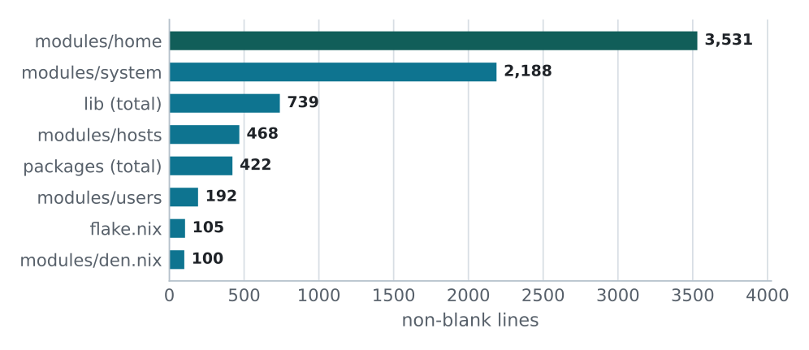
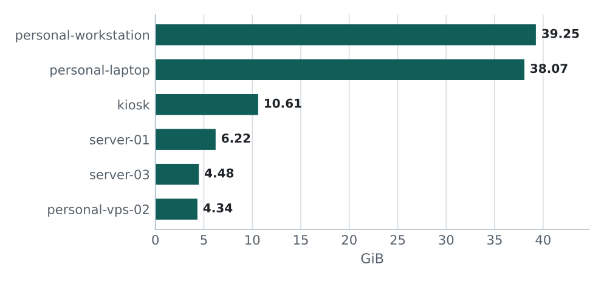
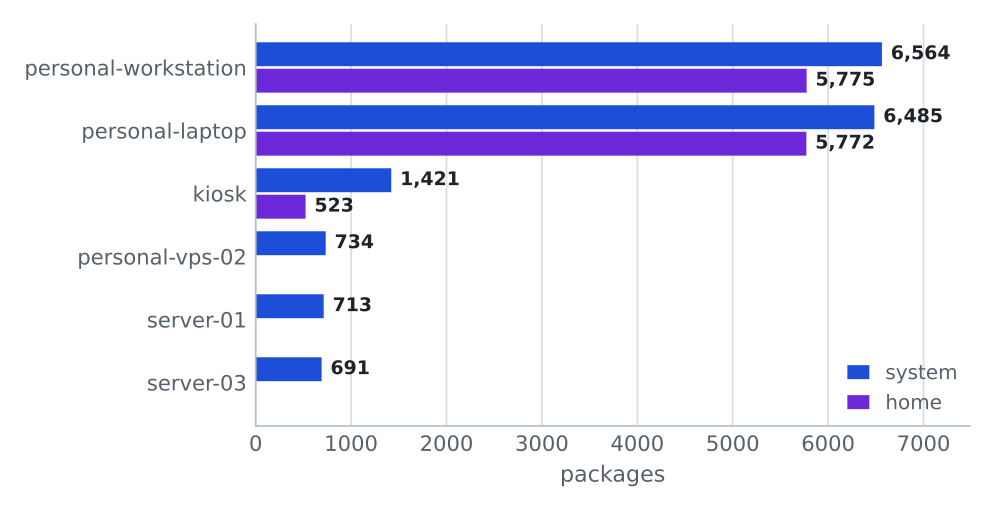
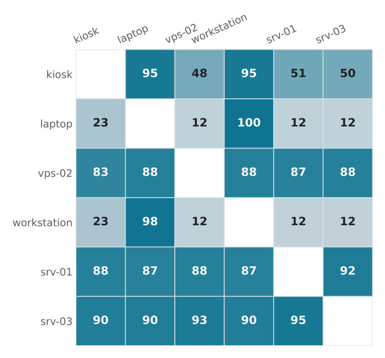

<div align="center">

# Infrastructure

NixOS configuration repository for managing multiple hosts using flakes.


[](https://github.com/mihakrumpestar/panix/blob/main/LICENSE)
[](https://nixos.org)

</div>

## Hosts

| Host | Type | Boot | Root enc. | Login | Secrets | Impermanence | Home Manager |
|:---|:---|:---|:---|:---|:---|:---|:---|
| personal-workstation | Client | Lanzaboote | FIDO2 | FIDO2 | TPM | Default | Full |
| personal-laptop | Client | Lanzaboote | FIDO2 | FIDO2 | TPM | Default | Full |
| server-01 | Server | Lanzaboote | TPM2 | Password | TPM | Default | None |
| server-03 | Server | systemd-boot | TPM2 | Password | TPM | Default | None |
| personal-vps-02 | Server and VM guest | GRUB | None | Password | SSH key | Default | None |
| kiosk | Client (kiosk) | Lanzaboote | TPM2 | Auto | TPM | Full | Kiosk only |

## Build statistics

<!-- FAST_START -->
_Fast tier: refreshed automatically on every commit (pre-commit hook, task generate-fast)._

### Lines of code

7,745 non-blank lines, comments included and Markdown excluded.



<details>
<summary>Lines of code table</summary>

| Component        |   Lines |
|:-----------------|--------:|
| flake.nix        |     105 |
| modules/den.nix  |     100 |
| modules/hosts    |     468 |
| modules/system   |   2,188 |
| modules/home     |   3,531 |
| modules/users    |     192 |
| modules (total)  |   6,479 |
| packages (total) |     422 |
| lib (total)      |     739 |
| **Total**        |   7,745 |

</details>
<!-- FAST_END -->

---

<!-- HEAVY_START -->
_Heavy tier: refreshed manually with `task generate-heavy`, budgeted under 5 minutes; package counts come from the built closures. Last measured 2026-09-21._

### Fleet

One row per host, from the built system and home profiles.

| Host                 | Desktop   |   Closure (GiB) |   System pkgs |   Home pkgs |   Services |   Secrets |
|:---------------------|:----------|----------------:|--------------:|------------:|-----------:|----------:|
| kiosk                | plasma    |           10.61 |         1,421 |         523 |         98 |         1 |
| personal-laptop      | plasma    |           38.07 |         6,485 |       5,772 |        100 |         2 |
| personal-vps-02      | n/a       |            4.34 |           734 |         n/a |         81 |         1 |
| personal-workstation | plasma    |           39.25 |         6,564 |       5,775 |        100 |         2 |
| server-01            | n/a       |            6.22 |           713 |         n/a |         87 |         1 |
| server-03            | n/a       |            4.48 |           691 |         n/a |         76 |         1 |





Union closure 40.91 GiB; summing the hosts separately gives 102.97 GiB, so 60% is shared.

### Closure reuse

Share of each row host's closure that also appears in the column host's closure.



<details>
<summary>Reuse matrix</summary>

| Host                 |   kiosk |   personal-laptop |   personal-vps-02 |   personal-workstation |   server-01 |   server-03 |
|:---------------------|--------:|------------------:|------------------:|-----------------------:|------------:|------------:|
| kiosk                |         |               95% |               48% |                    95% |         51% |         50% |
| personal-laptop      |     23% |                   |               12% |                   100% |         12% |         12% |
| personal-vps-02      |     83% |               88% |                   |                    88% |         87% |         88% |
| personal-workstation |     23% |               98% |               12% |                        |         12% |         12% |
| server-01            |     88% |               87% |               88% |                    87% |             |         92% |
| server-03            |     90% |               90% |               93% |                    90% |         95% |             |

</details>
<!-- HEAVY_END -->

## Dependency graph

<!-- DEPS_START -->

```mermaid
%%{init: {
  'theme': 'base',
  'themeVariables': {
    'fontSize': '14px',
    'fontFamily': 'system-ui',
    'lineColor': '#6e7681',
    'textColor': '#6e7681',
    'titleColor': '#6e7681',
    'clusterLabelColor': '#6e7681',
    'clusterBkg': 'transparent',
    'clusterBorder': '#7d8590'
  },
  'flowchart': {
    'nodeSpacing': 3,
    'rankSpacing': 40,
    'padding': 2,
    'diagramPadding': 3
  }
}}%%

flowchart LR

    %% Styles
    classDef input fill:#2563eb,stroke:#60a5fa,stroke-width:1px,color:#ffffff
    classDef local fill:#b45309,stroke:#fbbf24,stroke-width:1px,color:#ffffff
    classDef flake fill:#0e7490,stroke:#22d3ee,stroke-width:1.5px,color:#ecfeff
    classDef hosts fill:#0f766e,stroke:#2dd4bf,stroke-width:1px,color:#f0fdfa
    classDef users fill:#7c3aed,stroke:#a78bfa,stroke-width:1px,color:#f5f3ff
    classDef aspect fill:#e9eff6,stroke:#5a7086,stroke-width:1.5px,color:#1f2328
    classDef config fill:#64748b,stroke:#cbd5e1,stroke-width:1px,color:#ffffff

    subgraph Inputs[Inputs]
        input_agenix["agenix"]:::input
        input_browser_harness_js["browser-harness-js"]:::input
        input_den["den"]:::input
        input_disko["disko"]:::input
        input_home_manager["home-manager"]:::input
        input_impermanence["impermanence"]:::input
        input_import_tree["import-tree"]:::input
        input_infrastructure_secrets["infrastructure-secrets"]:::input
        input_lanzaboote["lanzaboote"]:::input
        input_mattpocock_skills["mattpocock-skills"]:::input
        input_nix_index_database["nix-index-database"]:::input
        input_nix_vscode_extensions["nix-vscode-extensions"]:::input
        input_nixpkgs["nixpkgs"]:::input
        input_nur["nur"]:::input
        input_obsidian_extensions["obsidian-extensions"]:::input
        input_openchamber["openchamber"]:::input
        input_plasma_manager["plasma-manager"]:::input
        input_stylix["stylix"]:::input
        input_tix["tix"]:::input
        local_consul_cni["./packages/consul-cni"]:::local
        local_mutable_file["./lib/mutable-file"]:::local
        local_opencode_plugins["./lib/opencode-plugins"]:::local
        local_virtualhere["./packages/virtualhere"]:::local
    end

    subgraph Core[Core]
        flake["flake"]:::flake
        den["den"]:::flake
    end

    subgraph SystemAspects[System Aspects]
        sys_core["core"]:::aspect
        sys_disks["disks"]:::aspect
        sys_impermanence["impermanence"]:::aspect
        sys_locale["locale"]:::aspect
        sys_networking["networking"]:::aspect
        sys_nix["nix"]:::aspect
        sys_secrets["secrets"]:::aspect
        sys_shell["shell"]:::aspect
        sys_shell_fonts["shell/fonts"]:::aspect
        sys_shell_packages["shell/packages"]:::aspect
        sys_shell_starship["shell/starship"]:::aspect
        sys_shell_zsh["shell/zsh"]:::aspect
        sys_style["style"]:::aspect
        opt_container_runtime["container-runtime"]:::aspect
        opt_consul["consul"]:::aspect
        opt_docker["docker"]:::aspect
        opt_nomad["nomad"]:::aspect
        opt_nvidia["nvidia"]:::aspect
        opt_peripherals["peripherals"]:::aspect
        opt_plasma["plasma"]:::aspect
        opt_podman["podman"]:::aspect
        opt_virtualization["virtualization"]:::aspect
        type_client["client"]:::aspect
        type_server["server"]:::aspect
        type_vm_guest["vm-guest"]:::aspect
    end

    subgraph HomeAspects[Home Namespace Aspects]
        home_autostart["autostart"]:::aspect
        home_backup["backup"]:::aspect
        home_clipboard["clipboard"]:::aspect
        home_dead_mens_switch["dead-mens-switch"]:::aspect
        home_common["common"]:::aspect
        home_git["git"]:::aspect
        home_home_apps["home-apps"]:::aspect
        home_ide["ide"]:::aspect
        home_kiosk_brightness["kiosk-brightness"]:::aspect
        home_kiosk_browser["kiosk-browser"]:::aspect
        home_llm_agent["llm/agent"]:::aspect
        home_llm["llm"]:::aspect
        home_llm_gateway["llm/gateway"]:::aspect
        home_llm_mcp["llm/mcp"]:::aspect
        home_llm_ui["llm/ui"]:::aspect
        home_note_taking["note-taking"]:::aspect
        home_password_manager["password-manager"]:::aspect
        home_scripts["scripts"]:::aspect
        home_ssh["ssh"]:::aspect
        home_storage["storage"]:::aspect
        home_web_browser_policies["web-browser/policies"]:::aspect
        home_web_browser["web-browser"]:::aspect
    end

    subgraph Hosts[Hosts]
        host_kiosk["kiosk"]:::hosts
        host_kiosk_hardware["hardware"]:::config
        host_personal_laptop["personal-laptop"]:::hosts
        host_personal_laptop_hardware["hardware"]:::config
        host_personal_vps_02["personal-vps-02"]:::hosts
        host_personal_vps_02_hardware["hardware"]:::config
        host_personal_workstation["personal-workstation"]:::hosts
        host_personal_workstation_hardware["hardware"]:::config
        host_server_01["server-01"]:::hosts
        host_server_01_hardware["hardware"]:::config
        host_server_03["server-03"]:::hosts
        host_server_03_hardware["hardware"]:::config
    end

    subgraph Users[Users]
        user_admin["admin"]:::users
        user_kiosk["kiosk"]:::users
        user_krumpy_miha["krumpy-miha"]:::users
    end


    den --> host_kiosk
    den --> host_personal_laptop
    den --> host_personal_vps_02
    den --> host_personal_workstation
    den --> host_server_01
    den --> host_server_03
    den --> sys_core
    den --> sys_disks
    den --> sys_impermanence
    den --> sys_locale
    den --> sys_networking
    den --> sys_nix
    den --> sys_secrets
    den --> sys_shell
    den --> sys_style
    den --> user_admin
    den --> user_kiosk
    den --> user_krumpy_miha
    flake --> den
    home_kiosk_browser --> home_web_browser_policies
    home_llm --> home_llm_agent
    home_llm --> home_llm_gateway
    home_llm --> home_llm_mcp
    home_llm --> home_llm_ui
    home_web_browser --> home_web_browser_policies
    host_kiosk --> host_kiosk_hardware
    host_kiosk --> type_client
    host_personal_laptop --> host_personal_laptop_hardware
    host_personal_laptop --> opt_docker
    host_personal_laptop --> opt_podman
    host_personal_laptop --> opt_virtualization
    host_personal_laptop --> type_client
    host_personal_vps_02 --> host_personal_vps_02_hardware
    host_personal_vps_02 --> opt_nomad
    host_personal_vps_02 --> type_server
    host_personal_vps_02 --> type_vm_guest
    host_personal_workstation --> home_backup
    host_personal_workstation --> home_dead_mens_switch
    host_personal_workstation --> host_personal_workstation_hardware
    host_personal_workstation --> opt_docker
    host_personal_workstation --> opt_podman
    host_personal_workstation --> opt_virtualization
    host_personal_workstation --> type_client
    host_server_01 --> host_server_01_hardware
    host_server_01 --> type_server
    host_server_03 --> host_server_03_hardware
    host_server_03 --> type_server
    input_agenix --> flake
    input_browser_harness_js --> flake
    input_den --> flake
    input_disko --> flake
    input_home_manager --> flake
    input_impermanence --> flake
    input_import_tree --> flake
    input_infrastructure_secrets --> flake
    input_lanzaboote --> flake
    input_mattpocock_skills --> flake
    input_nix_index_database --> flake
    input_nix_vscode_extensions --> flake
    input_nixpkgs --> flake
    input_nur --> flake
    input_obsidian_extensions --> flake
    input_openchamber --> flake
    input_plasma_manager --> flake
    input_stylix --> flake
    input_tix --> flake
    local_consul_cni --> flake
    local_mutable_file --> flake
    local_opencode_plugins --> flake
    local_virtualhere --> flake
    opt_docker --> opt_container_runtime
    opt_nomad --> opt_consul
    opt_nomad --> opt_podman
    opt_podman --> opt_container_runtime
    sys_shell --> sys_shell_fonts
    sys_shell --> sys_shell_packages
    sys_shell --> sys_shell_starship
    sys_shell --> sys_shell_zsh
    type_client --> opt_peripherals
    type_client --> opt_plasma
    type_server --> user_admin
    type_vm_guest --> user_admin
    user_kiosk --> home_common
    user_kiosk --> home_kiosk_brightness
    user_kiosk --> home_kiosk_browser
    user_krumpy_miha --> home_autostart
    user_krumpy_miha --> home_clipboard
    user_krumpy_miha --> home_common
    user_krumpy_miha --> home_git
    user_krumpy_miha --> home_home_apps
    user_krumpy_miha --> home_ide
    user_krumpy_miha --> home_llm
    user_krumpy_miha --> home_note_taking
    user_krumpy_miha --> home_password_manager
    user_krumpy_miha --> home_scripts
    user_krumpy_miha --> home_ssh
    user_krumpy_miha --> home_storage
    user_krumpy_miha --> home_web_browser

```
<!-- DEPS_END -->

## Repository structure

```text
infrastructure/
├── flake.nix, flake.lock          # Flake entry point and pinned inputs
├── devenv.nix, Taskfile.yml       # Tooling shell and tasks (generate, ci)
├── modules/                       # Den aspects
│   ├── den.nix                    # Host declarations and aspect composition
│   ├── hosts/                     # Per-host configs and hardware
│   ├── users/                     # User accounts
│   ├── system/                    # default, optional, and type aspects
│   └── home/                      # Home-manager aspects
├── packages/, lib/                # Custom package and library flakes
├── scripts/                       # Stats pipeline and dependency graph
├── assets/                        # Wallpaper and stats charts
├── docs/                          # Operational notes
├── decommissioned/                # Retired host configs
└── generated/                     # Timestamped run artifacts (gitignored)
```

## TODO

- https://saylesss88.github.io/nix/hardening_NixOS.html
- https://github.com/yorukot/superfile
- https://github.com/amadejkastelic/nixos-config/tree/main/hosts/server
- https://docs.nixbuild.net/remote-builds/

## References

Sources:

- https://nixos-and-flakes.thiscute.world
- https://teu5us.github.io/nix-lib.html
- https://nixsearch.thekoppe.com (better Nix packages and options search)

Configs:

- https://github.com/mightyiam/infra: dendritic pattern
- https://github.com/vic/vix: dendritic pattern
- https://github.com/GaetanLepage/nix-config
- https://github.com/raexera/yuki
- https://github.com/wiedzmin/nixos-config
- https://github.com/Zaechus/nixos-config
- https://github.com/erictossell/nixflakes
- https://github.com/etu/nixconfig
- https://codeberg.org/highghlow/nixos-config
- https://github.com/leoank/neusis: Nvidia Datacenter GPU
- https://github.com/pranjalv123/nix-config: VMs
- https://github.com/abehidek/nix-config: VMs

## Theme

Stylix paints the fleet from `assets/backgrounds/nebula-8k-wallpaper.jpg`.


## License

MIT licensed. See `LICENSE`.
